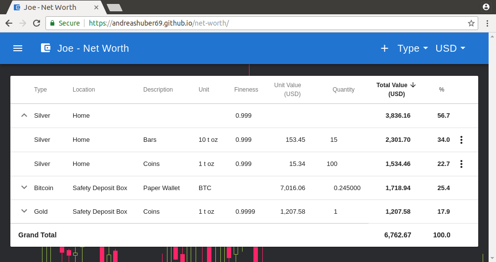

  

  
  
  
  
  

<h1 align="center">Net Worth</h1>

If you primarily store your wealth in "unconventional" assets like precious metals and crypto currencies, it seems there
are almost no tools that would help you get an overview of your current financial situation.

Net Worth aims to change that. In a nutshell, the application presents your precious metal and crypto currency
holdings in a groupable and sortable table, which allows you to quickly see how your net worth is spread among the
different asset types and locations.

## Features

- Supported precious metals: **Silver**, **Palladium**, **Platinum**, **Gold**
- Supported crypto currencies: **Bitcoin**, **Litecoin**, **Ethereum Classic**, **ERC20 Tokens**, **Ethereum**,
  **Bitcoin Gold**, **Dash**, **Zcash**.
  Others will be implemented depending on demand.
- Assets can be grouped according to asset type or location.
- Assets other than precious metals and cryptos can be added as (manually valued) Misc assets.
- Liabilities can be added as negatively valued Misc assets.
- Supported valuation currencies: 27 fiat currencies plus silver ounces (XAG), gold ounces (XAU) and Bitcoin (BTC)
- Intuitive, flexible user interface that auto-adapts to almost any screen size.
- Free, open-source, no ads
- No installation, works on almost any platform, including mobile phones and Raspberry Pis.

## Usage

### Getting Started

Net Worth runs in your internet browser but works and feels much like a conventional desktop application. There are
no logins, no passwords and your data is only ever stored locally on your computer.

While the application should work in most recent internet browsers, for privacy reasons it is recommended to
install either **Chromium** or **Firefox** and point it to <https://andreashuber69.github.io/net-worth>.

In the toolbar on the left there's a menu with the usual suspects **New**, **Open...**, **Save**, **Save As...** and
**About**.
On the right, you'll find a button to add a new asset and controls to change the asset grouping and the valuation
currency.

In the table, clicking on a row representing an asset group will expand/collapse it. For example, in the screenshot
above, the **Silver** group is expanded, such that the grouped assets become visible. Individual assets can be edited
and deleted with the triple-dot menu at the end of each row. Some columns can be sorted by clicking on their headers.

### Privacy

- **Data Storage**: The data you enter into Net Worth is only ever stored locally in your browser and can be saved
  to a file on your hard drive. Browser data sync services should not be used, as anything these can synchronize they
  can potentially also leak.
- **Queries**: The application makes queries about precious metal prices and currency exchange rates (quandl.com) plus
  crypto currency prices (coinmarketcap.com). For crypto currencies, you have the option to also track your balance. If
  you choose to do so, the application will also send your public address to an online service like e.g.
  [blockchain.info](https://blockchain.info).
- **Encryption**: All queries are always encrypted (https), but of course the owners of the respective services will
  have access to the contents of the queries (which can be attributed to you via your IP address). If you have concerns
  about that, you should use a reputable VPN provider or even TOR.

## Known Issues / Feedback

Please use the [GitHub Issue Tracker](https://github.com/andreashuber69/net-worth/issues) to see the known issues, ask
your questions, report problems or suggest improvements. Thank you!

## Source Code

The source code and full change history is available at <https://github.com/andreashuber69/net-worth>. Map files are
deployed with the production code, so you can also review the code with the browser developer tools while your browser
is directed to <https://andreashuber69.github.io/net-worth>.
